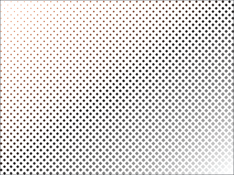
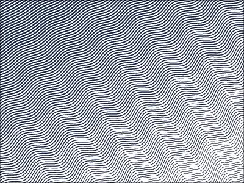
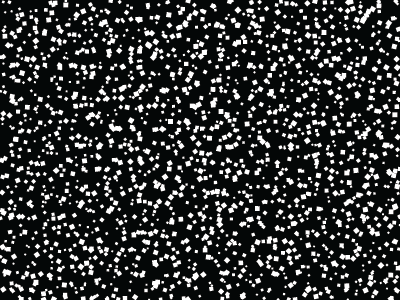
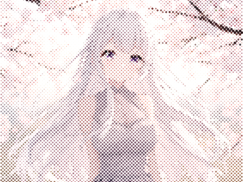

# Halftone Pro

> A professional vector halftone CEP extension for Adobe Illustrator.
> 4 mode tabs - Spots, Lines, Stipple, Image - with live canvas preview, 25 one-click presets, and fully editable vector output.


---

## Overview

**Halftone Pro** is an Adobe CEP extension (HTML/JS panel) that generates fully editable vector halftone patterns directly inside Illustrator. Every dot, line, and stipple mark is a native vector path - no rasterization, no live effects, no third-party dependencies.

Built and maintained by [Petra-dot](https://github.com/petra-dot).

### What's new in v4.0

- **CEP Panel** replaces the old ScriptUI dialog - dockable, resizable, with smooth UI
- **Live canvas preview** - see your pattern update in real time as you adjust sliders
- **4 mode tabs** - Spots, Lines, Stipple, Image, each with independent settings
- **25 one-click presets** - expanded from 15 to cover all 4 tabs, each carefully tuned
- **Wavy and cross-hatch lines** - smooth Catmull-Rom to Cubic Bezier curves with luma-modulated amplitude
- **Cross-hatch perpendicular sources** - multi-pass lines with configurable per-pass source directions for rich shadow density
- **Image import** - drop any image, the engine generates dots from its luma or color data (256×256 grid)
- **Custom symbol capture** - select any path in Illustrator and use it as a dot shape
- **Stipple mode** - high-scatter random dot distribution for organic, hand-drawn effects
- **Per-tab state memory** - switching tabs preserves each tab's unique settings
- **Safe recursive-descent JSON parser** - no eval, no arbitrary code execution
- **Sequential command queue** - reliable grid transfer + generate pipeline with error handling
- **8 blend modes** - normal, multiply, screen, overlay, soft/hard light, darken, lighten

---

## Preview

| Spots | Lines | Stipple | Image |
|---|---|---|---|
|  |  |  |  |

---

## Features

**4 Mode Tabs**
- **Spots** - classic halftone dots with 6 shape types and configurable grid
- **Lines** - straight, wavy, and cross-hatch lines with variable-width strokes, multi-pass angles, and perpendicular sources
- **Stipple** - high-scatter organic dot distribution with random size, rotation, opacity, and flip
- **Image** - import an image and generate dots from its luma or color data, with aspect-ratio-preserving preview

**6 Dot Shapes**
- Circle, Square, Triangle, Hexagon, Diamond, Custom (capture any path)

**3 Line Modes**
- **Straight** - single clean strokes with luma-driven variable width
- **Wavy** - smooth Bezier curves with luma-modulated sine-wave amplitude
- **Cross-hatch** - multi-pass overlapping lines with configurable pass angles, per-pass sources (diagonal, perpendicular, perpendicular-reversed), and wavy/straight per-pass selection

**25 One-Click Presets**
- Spots (10) - Classic Newspaper, Fine Art Screen, Coarse Pop-Art, Gradient Wash, Hex Honeycomb, Diamond Editorial, Risograph, Scatter Pop, Radial Burst, Micro Texture, Offset Press
- Lines (5) - Banknote Engraving, Cross-Hatch Shadow, Ribbon Lines, Blueprint Grid, Poster Hatch
- Stipple (5) - Stipple Portrait, Brutalist Scatter, Ink Splatter, Grit Texture, Pointillism
- Image (5) - CMYK Print, Duotone Dream, Posterized, Watercolor Edge, Neon Glow

**Luma Sources for Dot Sizing**
- Uniform, Diagonal, Linear, Linear Rev, Radial, Image (tab 3)
- Gamma correction with adjustable midpoint
- Invert toggle

**Color Modes**
- **Flat (cMode 0)** - single solid color across all dots
- **2-Color (cMode 1)** - gradient between two colors based on luma
- **Gradient (cMode 2)** - 2 or 3-stop gradient sampled at each dot's canvas position, 6 directions (horizontal, vertical, diagonal, radial)
- **Image color (cMode 3)** - pixel-perfect color sampling from imported image (tab 3 only)

**Dynamics**
- Random rotation with min/max angle range
- Random opacity with min/max percentage range
- Random horizontal/vertical flip
- Random dot size mode
- Scatter jitter for organic placement
- Configurable per-dot randomness for stipple effects

**Output Controls**
- Clip mask to selection or artboard bounds
- Keep or remove source shape after generation
- Group all shapes or keep individual paths
- 8 blend modes + opacity control
- Named output layer with shape count

**Live Canvas Preview**
- Real-time rendering with 250ms debounce
- White, black, or checkerboard background
- Automatic artboard bounds detection
- Aspect-ratio-correct image overlay for Image tab
- Cross-hatch and wavy line rendering matches engine output

---

## Requirements

| Software | Version |
|---|---|
| Adobe Illustrator | CS6 or later (CC 2019 through CC 2025) |
| OS | Windows 10/11 or macOS 10.15+ |
| CEP | CSXS 11.0+ (built-in since Illustrator CC 2019) |

---

## Installation

### Windows

1. Run `install-windows.bat` as Administrator
2. Restart Adobe Illustrator
3. Go to **Window > Extensions > Halftone Pro**

The installer enables `PlayerDebugMode` for CSXS.11-15 and copies the extension to:
```
%APPDATA%\Adobe\CEP\extensions\com.petradot.halftonepro
```

### macOS

1. Open Terminal and run:
   ```bash
   chmod +x install-mac.sh && ./install-mac.sh
   ```
2. Restart Adobe Illustrator
3. Go to **Window > Extensions > Halftone Pro**

The installer enables `PlayerDebugMode` and copies the extension to:
```
~/Library/Application Support/Adobe/CEP/extensions/com.petradot.halftonepro
```

### Manual Install

Copy the `com.petradot.halftonepro` folder to your CEP extensions directory:

- **Windows:** `%APPDATA%\Adobe\CEP\extensions\`
- **macOS:** `~/Library/Application Support/Adobe/CEP/extensions/`

Then enable `PlayerDebugMode`:
- **Windows:** run `reg add "HKCU\Software\Adobe\CSXS.11" /v PlayerDebugMode /t REG_SZ /d 1 /f`
- **macOS:** run `defaults write com.adobe.CSXS.11 PlayerDebugMode 1`

---

## How to Use

### Fill the Artboard

1. Open an Illustrator document
2. Open the panel: **Window > Extensions > Halftone Pro**
3. Choose a tab (Spots, Lines, Stipple, or Image)
4. Adjust settings or pick a preset from the dropdown
5. Click **Generate**

The halftone fills the active artboard and is automatically clipped to its boundary.

### Fill a Selection

1. Draw any shape (rectangle, circle, custom path, compound path)
2. Select it with the Selection Tool
3. Open the panel and click **Generate**

The halftone fills the selected shape's bounding area and clips to it. The source shape is removed by default (uncheck **Keep source shape** to keep it).

### Use a Preset

1. Open the panel
2. Select a preset from the dropdown at the bottom
3. All settings load instantly
4. Tweak any value you want
5. Click **Generate**

### Wavy and Cross-Hatch Lines

On the Lines tab:
- **Straight** - uniform strokes with luma-driven width taper (top-to-bottom). Adjust Min and Max weight for the taper range.
- **Wavy** - smooth sine-wave lines with adjustable frequency and amplitude. Luma modulates amplitude - light areas have larger waves, dark areas have smaller waves.
- **Cross-hatch** - multi-pass overlapping lines. Configure the number of passes, angle offset per pass, and per-pass source directions. Use "diagonal" sources for wavy cross-hatch, or "perp"/"perp-rev" sources for straight variable-width cross-hatch (dense shadow buildup).

### Stipple Mode

The Stipple tab uses high-scatter dot placement for organic, hand-drawn effects:
- **Scatter** controls how far dots drift from their grid position (0–100%)
- **Random size** creates varied dot weights throughout the pattern
- **Random rotation** with min/max angle range adds directional variety
- **Random opacity** with min/max range creates depth through transparency
- **Random flip H/V** mirrors individual dots for asymmetrical texture
- Low cell size with high scatter produces dense, chaotic stipple - ideal for portrait and texture work

### Import an Image

1. Switch to the **Image** tab
2. Drop an image onto the dashed drop zone (or click to browse)
3. The preview updates with the image overlaid
4. Adjust cell size, gap, min/max scale, and gamma
5. Rotate the grid angle to change the dot pattern orientation
6. Check **Place source image on artboard** to include the original image in the output
7. Click **Generate**

The halftone respects the image's aspect ratio (contain scaling) and uses the image's luma for dot sizing. With Color mode set to **Image color**, dots sample the image's actual pixel colors. The engine downsamples to a 256×256 grid for performance.

### Capture a Custom Dot Shape

1. Draw any path in Illustrator
2. Select it with the Selection Tool
3. In the panel, click **Use Selected Path as Dot**
4. The custom shape appears in the preview and is used for all dots
5. Click **Clear** to revert to the standard shape

The custom shape is normalized to a -0.5 to 0.5 bounding box and is remembered across sessions.

---

## Panel Reference

### Spots Tab

| Section | Controls |
|---|---|
| Shape | Circle, Square, Triangle, Hexagon, Diamond, Custom |
| Grid & Spacing | Cell size, Gap %, Min scale %, Max scale %, Angle, Random dot size |
| Dot Size Source | Uniform, Diagonal, Linear, Linear Rev, Radial, Invert, Gamma, Midpoint |
| Color | Flat, 2-Color, Gradient (2 or 3-stop, 6 directions) |
| Dynamics | Random rotation (min/max), Random opacity (min/max), Random flip H/V, Scatter jitter |
| Output | Clip mask, Keep source shape, Group shapes, Blend mode, Opacity |

### Lines Tab

| Section | Controls |
|---|---|
| Line Mode | Straight, Wavy, Cross-hatch |
| Grid | Spacing, Angle, Min weight, Max weight |
| Wavy / Cross-hatch | Frequency, Amplitude, Number of passes, Pass angle |
| Darkness Source | Uniform, Diagonal, Linear, Linear Rev, Radial, Invert, Gamma |
| Color | Flat, 2-Color, Gradient (2 or 3-stop, 6 directions) |
| Dynamics | Random line width, Random opacity, Scatter jitter |
| Output | Clip mask, Keep source shape, Group shapes, Blend mode, Opacity |

### Stipple Tab

| Section | Controls |
|---|---|
| Shape | Circle, Square, Triangle, Hexagon, Diamond, Custom |
| Grid & Scatter | Cell size, Gap %, Min scale %, Max scale %, Angle, Scatter % |
| Dot Size Source | Uniform, Diagonal, Linear, Linear Rev, Radial, Invert, Gamma, Midpoint |
| Color | Flat, 2-Color, Gradient (2 or 3-stop, 6 directions) |
| Dynamics | Random rotation (min/max), Random opacity (min/max), Random flip H/V, Random dot size |
| Output | Clip mask, Keep source shape, Group shapes, Blend mode, Opacity |

### Image Tab

| Section | Controls |
|---|---|
| Image Import | Drop zone, image name, Clear, Place source image on artboard |
| Dot Settings | Shape (Circle, Square, Triangle, Hexagon, Diamond), Cell size, Gap %, Min scale %, Max scale %, Angle |
| Brightness | Invert, Gamma, Midpoint |
| Color | Flat, 2-Color, Gradient (2 or 3-stop, 6 directions), Image color (cMode 3) |
| Dynamics | Random rotation (min/max), Random opacity (min/max), Random flip H/V |
| Output | Clip mask, Keep source shape, Group shapes, Blend mode, Opacity |

### Shared: Dynamics

| Control | Description |
|---|---|
| Random rotation | Rotate each dot by a random angle between min and max degrees |
| Random opacity | Set each dot's opacity to a random value between min and max percent |
| Random flip H | Horizontally mirror individual dots randomly |
| Random flip V | Vertically mirror individual dots randomly |
| Random dot size | Multiply each dot's scale by a random 0.5–1.5 factor |
| Scatter jitter | Shift each dot from its grid position by a random offset (0–100% of cell) |

### Shared: Color Modes

| Mode | Description |
|---|---|
| Flat (cMode 0) | All dots use a single color |
| 2-Color (cMode 1) | Two colors: dots transition between them based on luma |
| Gradient (cMode 2) | 2 or 3-stop gradient sampled at each dot's canvas position. 6 directions: horizontal, vertical, both diagonals, radial |
| Image color (cMode 3) | Each dot samples the actual pixel color from the imported image (Image tab only) |

---

## Presets Reference

### Spots (10 presets)

| Preset | Description |
|---|---|
| Classic Newspaper | 45° diagonal screen, multiply blend, tight spacing - the traditional newsprint halftone |
| Fine Art Screen | Fine 30° screen with subtle gradient wash for high-detail reproduction |
| Coarse Pop-Art | Bold uniform red dots with 80% min scale - classic Lichtenstein-style pop art |
| Gradient Wash | 3-stop color gradient (gold → teal → dark) across diagonal diamond grid at 30° |
| Hex Honeycomb | Uniform golden hexagons at 15° with multiply blend |
| Diamond Editorial | 22° diamond screen with two-tone (charcoal → red) editorial color |
| Risograph | 2-color lo-fi duplicator print with moderate scatter and 80% max scale |
| Scatter Pop | 4-color random scatter with varied opacities - Ben-Day dot feel using diagonal gradient |
| Radial Burst | Radial gradient from gold to dark, invert on - dramatic radial burst effect |
| Micro Texture | Dense micro-dot at 35% opacity for subtle paper texture |
| Offset Press | Classic 45° offset plate simulation with blue ink at 50% |

### Lines (5 presets)

| Preset | Description |
|---|---|
| Banknote Engraving | Fine wavy lines at 30° with deep navy, 8 waves/line - currency-style engraving |
| Cross-Hatch Shadow | 3-pass cross-hatch (30°/60°/90°) with perpendicular sources for dense shadow buildup, gamma 0.6 |
| Ribbon Lines | Bold wavy ribbon lines at 45° with 45pt amplitude, 2-color gradient (pink → yellow), screen blend |
| Blueprint Grid | True 0°/90° cross-grid with fine precision strokes - technical blueprint aesthetic |
| Poster Hatch | Bold 30°/120° cross-hatch with 14pt spacing and gentle 10pt wave - poster-style hatching |

### Stipple (5 presets)

| Preset | Description |
|---|---|
| Stipple Portrait | Heavy scatter (80%) diagonal dots, gamma 1.4 for organic portrait stipple |
| Brutalist Scatter | Large spaced squares with full scatter (70%), random rotation 0–180°, uniform distribution |
| Ink Splatter | Full scatter (100%) dual-tone with random size and rotation - chaotic ink spray effect |
| Grit Texture | Dense micro-diamond dots at 50% opacity with 40% max scale - subtle film grain texture |
| Pointillism | Full scatter (100%) with gamma 1.6, color mode 3 for natural pointillist dispersion |

### Image (5 presets)

| Preset | Description |
|---|---|
| CMYK Print | 4-color CMYK simulation using circle dots at 10pt cell with multiply blend |
| Duotone Dream | 2-color duotone (charcoal → orange) with diagonal source, 12pt cell |
| Posterized | High-contrast (gamma 2.5) squares at 16pt cell - crushed black/white poster effect |
| Watercolor Edge | Diamond dots at 45°, 14pt cell, dual-tone (teal → light blue), 80% opacity |
| Neon Glow | Fine 8pt circle dots with pink/cyan gradient, screen blend, gamma 1.8 - glowing neon effect |

---

## Architecture

```
com.petradot.halftonepro/
  index.html            Panel UI (HTML)
  CSXS/manifest.xml     CEP extension manifest
  icon.png              Panel icon (32x32, orange + halftone dots)

  js/
    CSInterface.js      Adobe CEP host bridge
    halftone-math.js    Shared pure math (luma, color, gradients, grid coords)
    preview.js          Canvas preview renderer
    main.js             Panel controller, state management, presets, event wiring

  jsx/
    engine.jsx          ExtendScript engine (ES3, runs in Illustrator)

  css/
    style.css           Dark theme matching Illustrator UI

  images/               Preview screenshots and panel icon
  docs/                 Design specs and implementation plans

  install-windows.bat   Windows installer
  install-mac.sh        macOS installer
```

### Data Flow

1. **Preview path:** Slider change → `schedulePreview()` → `Object.assign({}, state)` → Canvas render (250ms debounce)
2. **Generate path:** Generate click → config payload built from state (grid/docBounds keys stripped) → `sendGridsThenGenerate()` pushes grid tasks (if needed) + generate task onto `runEvalChain()` → sequential `evalScript` calls → grid data sent via `setImageLuma`/`setImageColors` → `generateWithUndo` called with compact payload
3. **State persistence:** Per-tab snapshots via `saveTabState`/`restoreTabState` on tab switch. Custom shape persists across sessions via `localStorage`.

### Key Design Decisions

- **Grid data is sent separately from the generate payload** to avoid CEP's ~200 KB evalScript string limit. Luma and color grids (~82 KB each) go through their own evalScript calls before generate.
- **Shared math library** (`halftone-math.js`) is loaded by both the preview (CEF/JS) and the engine (ExtendScript via `$.evalFile`), ensuring identical luma and color calculations.
- **No eval** - the ExtendScript engine uses a recursive-descent parser for JSON, preventing arbitrary code execution from malformed input.
- **Per-tab snapshots** replace brute-force zeroing on tab switch. Each tab remembers its own line/spot/stipple/image settings independently.

---

## Tips

**Gradient across the whole halftone after generation**

The gradient Color mode samples per-dot positions - each dot gets a solid color. If you want a continuous gradient wash across all shapes, draw a rectangle over the output group, fill it with your gradient, and set its blend mode to Multiply.

**Performance**

For large artboards, increase cell size or line spacing to reduce shape count. The preview automatically debounces at 250ms. The engine has no upper shape limit but generation time scales with count. For the Image tab, the engine uses a 256×256 luma grid - large artboards with small cells produce the most shapes.

**Editing the result**

All output is standard vector paths in a named group on a named layer. Ungroup to access individual dots. Use Select > Same > Fill Color to select all dots of a specific color. Lines are stroked paths - adjust stroke weight, color, or cap style after generation.

**Stipple for texture**

Use the Stipple tab with low opacity, small cells (4-6pt), and high scatter to create subtle paper grain or noise textures. Combine with Multiply blend for layered texture effects.

**Cross-hatch shadow density**

For dense shadow areas with Cross-Hatch Shadow, use 3 passes with perpendicular sources. The perp mode draws stacked variable-width lines that build density without overlapping - ideal for engraved illustration.

**Debug mode**

Double-click the "v4.0" label in the panel header to reveal the raw engine response for troubleshooting.

---

## Changelog

| Version | Changes |
|---|---|
| **4.0** | Complete rewrite: CEP panel with HTML/CSS UI; 4 mode tabs (Spots, Lines, Stipple, Image); live canvas preview; 25 presets (expanded from 15); wavy and cross-hatch lines (Catmull-Rom to Cubic Bezier); perpendicular cross-hatch sources; image import with luma/color halftone (256×256 grid); custom symbol capture; stipple mode with full dynamics; per-tab state snapshots; safe JSON parser (no eval); shared math library; sequential command queue; 8 blend modes; dark theme; installers for Windows and macOS |
| 3.1 | Window title branding; version constants |
| 3.0 | Shapes outside bounds fixed; auto-clip to artboard; source shape removal timing fixed; color mode radio preset bug fixed |
| 2.0 | Gradient color map; gap/spacing slider; keep/remove source shape; CS6 compatibility |
| 1.0 | Initial release - 6 shape types, 15 presets, flat/multi/gradient color, dynamics |

---

## License

See [LICENSE](LICENSE). [SECURITY.md](SECURITY.md) covers installer behavior and CEP extension security.

---

## Contributing

Found a bug or have a feature request? Open an issue or submit a pull request at [github.com/petra-dot/halftone-pro](https://github.com/petra-dot/halftone-pro).

Please include:
- Your Illustrator version and OS
- A description of the issue or suggestion
- Screenshots if applicable

---

## Author

Made by [Petra-dot](https://github.com/petra-dot)

---

*If this extension saves you time, a star on the repo is always appreciated.*
