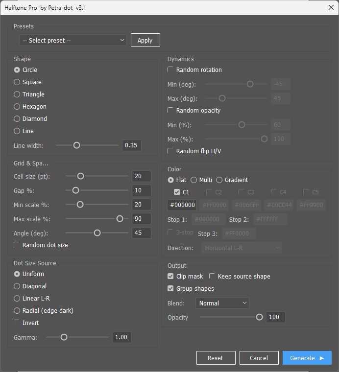
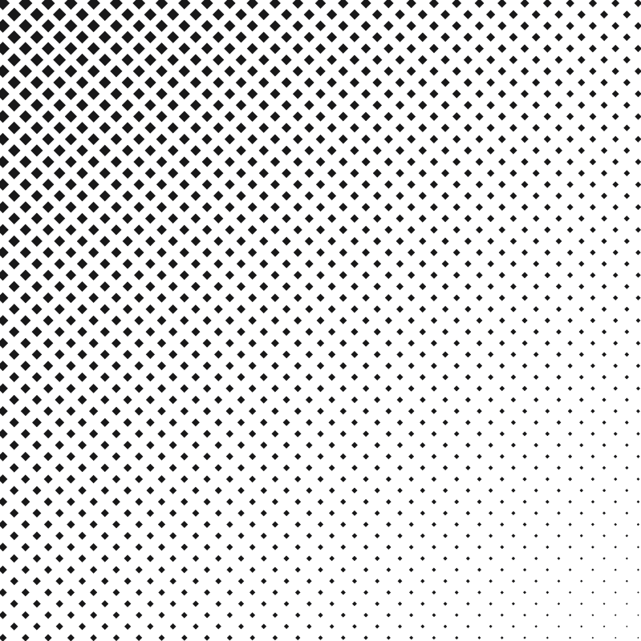
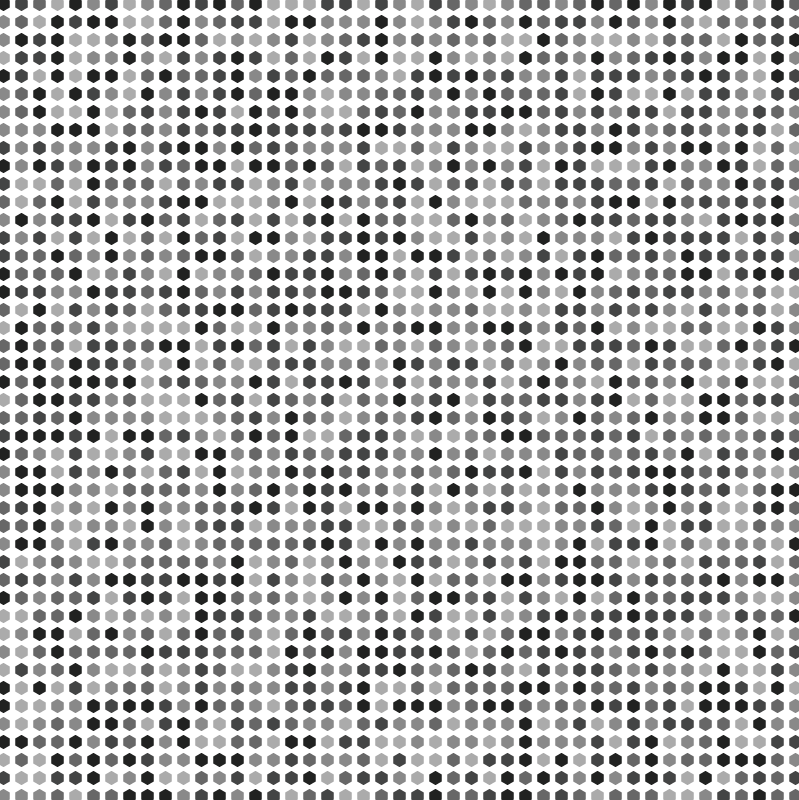
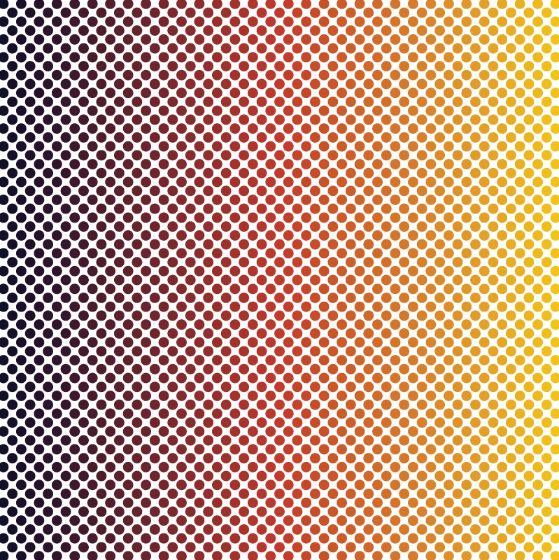
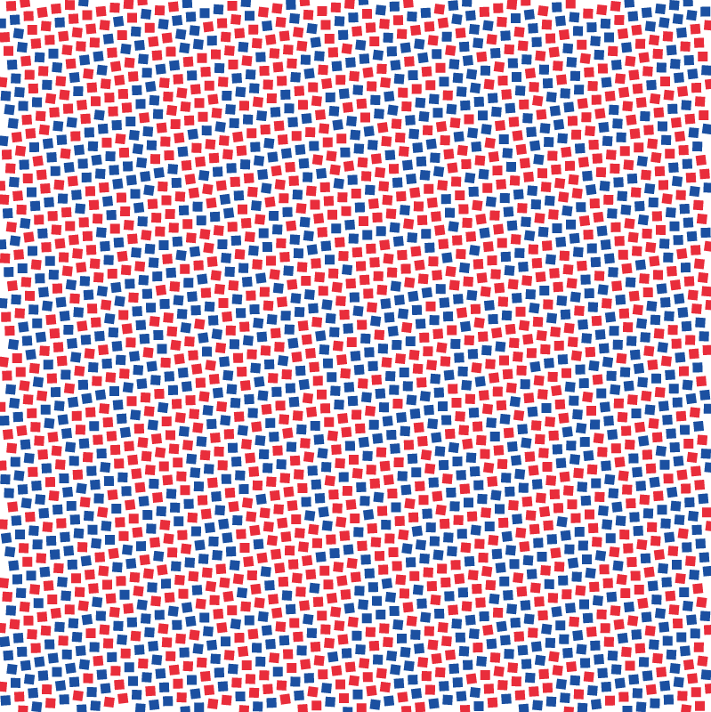
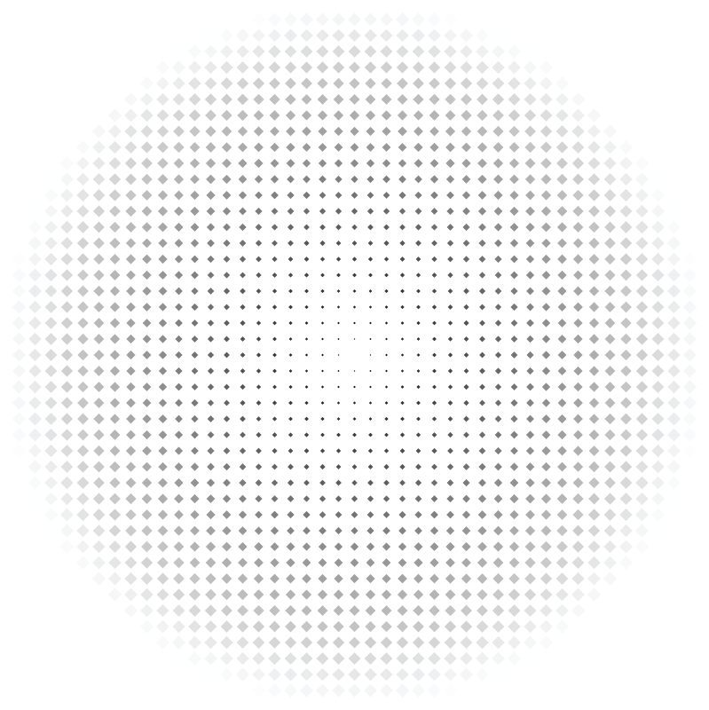
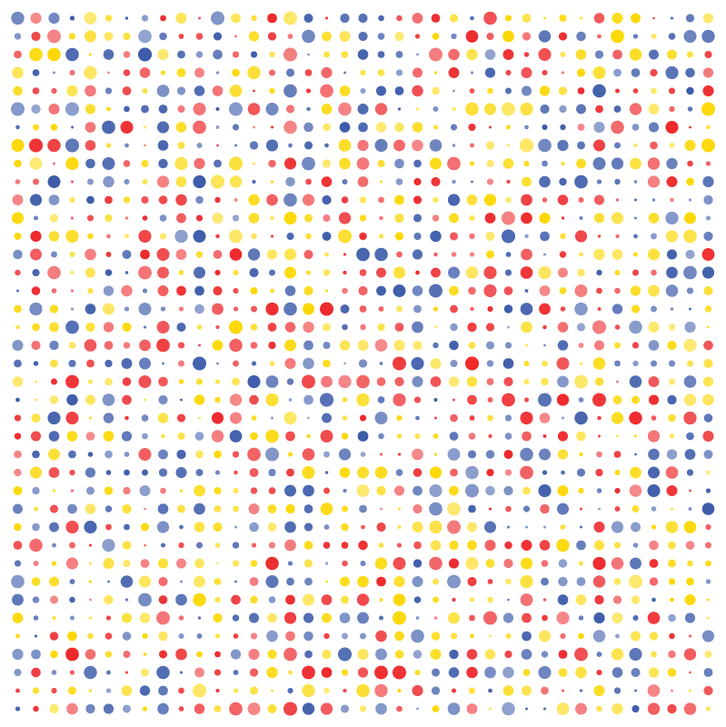

# Halftone Pro — by Petra-dot

> A professional vector halftone generator script for Adobe Illustrator.  
> 6 shape types · 15 one-click presets · gradient color mapping · fully editable output · v3.1

---



---

## Overview

**Halftone Pro** is an ExtendScript `.jsx` plugin for Adobe Illustrator that generates fully editable vector halftone patterns — circles, hexagons, diamonds, squares, triangles, and lines — with precise control over spacing, size, color, and tonal mapping. Every dot is a native vector path. No rasterization, no live effects, no third-party dependencies.

Built and maintained by [Petra-dot](https://github.com/petra-dot).

---

## Preview

| Classic Newspaper | Hex Honeycomb | Gradient Wash |
|---|---|---|
|  |  |  |

| Risograph | Radial Burst | Scatter Pop |
|---|---|---|
|  |  |  |

---

## Features

**6 Shape Types**
- Circle, Square, Triangle, Hexagon, Diamond, Line

**15 One-Click Presets**
- Classic Newspaper, Fine Art Screen, Coarse Pop-Art, Gradient Wash, Square Grid, Diamond Editorial, Hex Honeycomb, Engraving Lines, Radial Burst, Risograph, Scatter Pop, Offset Press, Micro Texture, Brutalist, Triangle Mesh

**Dot Size Control**
- Independent cell size and gap/spacing percentage
- Min and max scale range for tonal variation
- 4 luma sources: Uniform, Diagonal, Linear, Radial
- Gamma correction and brightness invert
- Random dot size mode

**Color Modes**
- **Flat** — single solid color
- **Multi** — up to 5 colors randomly assigned per dot
- **Gradient map** — 2 or 3-stop gradient sampled at each dot's canvas position, 6 directions

**Dynamics**
- Random rotation with min/max range
- Random opacity with min/max range
- Random horizontal/vertical flip

**Output**
- Auto-clips to selection shape or artboard boundary
- Optional clip mask, grouping, blend mode, layer opacity
- Source shape kept or removed after generation
- Named output layer with shape count
- Up to 60,000 shapes per run

---

## Requirements

| Software | Version |
|---|---|
| Adobe Illustrator | CS6, CC 2019, CC 2020, CC 2021, CC 2022, CC 2023, CC 2024, CC 2025 |
| OS | Windows 10/11 · macOS 10.15+ |

No installation of additional software or plugins required.

---

## Installation

### Windows

Copy `HALFTONE_PRO.jsx` to:

```
C:\Program Files\Adobe\Adobe Illustrator [version]\Presets\en_US\Scripts\
```

### macOS

Copy `HALFTONE_PRO.jsx` to:

```
/Applications/Adobe Illustrator [version]/Presets/en_US/Scripts/
```

### Activate

1. Restart Adobe Illustrator
2. Go to **File → Scripts → HALFTONE_PRO**

> **Alternative:** You can also run the script directly at any time via **File → Scripts → Other Script...** and browse to the file without copying it to the Scripts folder.

---

## How to Use

### Basic — Fill the Artboard

1. Open an Illustrator document
2. Run **File → Scripts → HALFTONE_PRO**
3. Choose a shape, adjust settings or pick a preset
4. Click **Generate ▶**

The halftone fills the active artboard and is automatically clipped to the artboard boundary.

### Fill a Custom Shape

1. Draw any shape (rectangle, circle, custom path — anything)
2. Select it with the Selection Tool
3. Run the script
4. The halftone fills the selected shape's bounding area and is clipped to it
5. The source shape is removed by default (check **Keep source shape** to keep it)

### Use a Preset

1. Open the script
2. Click the **Preset** dropdown and select a style
3. Click **Apply** — all settings load instantly
4. Adjust any value you want to tweak
5. Click **Generate ▶**

---

## Panel Reference

### Shape
| Control | Description |
|---|---|
| Shape type | Circle, Square, Triangle, Hexagon, Diamond, Line |
| Line width | Width of the Line shape as a fraction of dot radius |

### Grid & Spacing
| Control | Description |
|---|---|
| Cell size (pt) | Centre-to-centre distance between dots |
| Gap % | Extra padding around each dot, independent of cell size |
| Min scale % | Minimum dot size as % of cell half-size |
| Max scale % | Maximum dot size as % of cell half-size |
| Angle (deg) | Grid rotation angle 0–89° |
| Random dot size | Ignores luma source; each dot gets a random size between min and max |

### Dot Size Source
| Option | Description |
|---|---|
| Uniform | All dots drawn at Max scale |
| Diagonal | Top-left = dark (large), bottom-right = light (small) |
| Linear L-R | Left = dark, right = light |
| Radial | Edge = dark, centre = light |
| Invert | Flips the brightness map |
| Gamma | Adjusts the midtone curve of the tonal gradient |

### Dynamics
| Control | Description |
|---|---|
| Random rotation | Each dot rotated by a random amount in the min/max range |
| Random opacity | Each dot given a random opacity in the min/max range |
| Random flip H/V | Each dot randomly flipped horizontally or vertically |

### Color
| Mode | Description |
|---|---|
| Flat | Single solid color (C1) |
| Multi | Each dot randomly picks from enabled color slots C1–C5 |
| Gradient | Each dot gets a solid color sampled from a 2 or 3-stop gradient based on its canvas position |

### Output
| Control | Description |
|---|---|
| Clip mask | Clips the result to the selection shape or artboard |
| Keep source shape | When checked, the original selected shape is not deleted |
| Group shapes | Groups all dots into a single named group |
| Blend | Blend mode applied to the output group |
| Opacity % | Opacity of the output group |

---

## Presets Reference

| # | Preset | Shape | Style |
|---|---|---|---|
| 1 | Classic Newspaper | Circle | 45° diagonal gradient, tight spacing |
| 2 | Fine Art Screen | Circle | Fine 45° screen, high detail |
| 3 | Coarse Pop-Art | Circle | Large dots, bold editorial |
| 4 | Gradient Wash | Circle | 3-stop colour gradient wash |
| 5 | Square Grid | Square | Axis-aligned square grid |
| 6 | Diamond Editorial | Diamond | 45° diamonds with gold gradient |
| 7 | Hex Honeycomb | Hexagon | Uniform hexagons, true honeycomb |
| 8 | Engraving Lines | Line | Vertical engraving lines |
| 9 | Radial Burst | Circle | Large dots at edge, small at centre |
| 10 | Risograph | Square | 2-colour lo-fi duplicator print |
| 11 | Scatter Pop | Circle | 3-colour random scatter |
| 12 | Offset Press | Circle | Classic 15° offset plate angle |
| 13 | Micro Texture | Circle | Dense micro-dot fill texture |
| 14 | Brutalist | Circle | Random size and rotation |
| 15 | Triangle Mesh | Triangle | Diagonal triangle grid |

---

## Tips

**Applying a gradient across the whole halftone after generation**

Do not apply a gradient fill directly from the Swatches panel — Illustrator applies it per shape, not across the group. Instead:

- **Method 1 (recommended):** Draw a rectangle over the halftone group, fill it with your gradient, set its blend mode to **Multiply**. The gradient washes over the entire halftone non-destructively.
- **Method 2:** Select the halftone group, draw a gradient rectangle on top, select both, then in the **Transparency** panel choose **Make Opacity Mask**. Double-click the mask thumbnail to edit the gradient at any time.

**Performance**

For large artboards, increase cell size to reduce shape count. At 4pt cells on an A4 document you may approach the 60,000 shape limit. The script shows a warning if the limit is hit and outputs what it generated up to that point.

**Editing the result**

All output is standard vector paths in a named group on a named layer. Select the group, go to **Object → Ungroup** to access individual dots. Use **Edit → Select Same → Fill Color** to select all dots of a specific color.

---

## Changelog

| Version | Changes |
|---|---|
| **v3.1** | Window title updated with Petra-dot branding; version constants added; changelog consolidated |
| v3.0 | Shapes outside bounds fixed (exact cull + artboard auto-clip); source shape removal timing fixed; color mode radio fixed for all presets; auto-clip to artboard when no selection |
| v2.0 | Gradient color map (position-sampled per dot, 6 directions, 2–3 stops); gap/spacing slider; keep/remove source shape; luma from canvas position (fixes rotated grid distribution); clip mask structure rebuilt; CS6 compatibility |
| v1.0 | Initial release — 6 shape types, 15 presets, flat/multi/gradient color, dynamics, gap control, clip mask, two-column UI |

---

## License

```
Halftone Pro  by Petra-dot
Copyright (c) 2024 Petra-dot (github.com/petra-dot)

Permission is hereby granted, free of charge, to any person obtaining a copy
of this software for personal or commercial use, including the rights to use,
run, and produce output with this software without restriction.

The following restrictions apply:

1. RESELLING PROHIBITED. You may not sell, license, sublicense, or otherwise
   distribute this script itself — in original or modified form — as a paid
   product or as part of a paid product, bundle, or toolkit.

2. REDISTRIBUTION. You may share this script freely provided this copyright
   notice and license text remain intact and unmodified.

3. MODIFICATION. You may modify this script for your own personal use.
   Modified versions may not be publicly distributed or sold without explicit
   written permission from Petra-dot.

4. OUTPUT. Artwork generated using this script is entirely yours. There are
   no restrictions on the use, sale, or distribution of output created with
   this tool.

THIS SOFTWARE IS PROVIDED "AS IS", WITHOUT WARRANTY OF ANY KIND, EXPRESS OR
IMPLIED. IN NO EVENT SHALL THE AUTHOR BE LIABLE FOR ANY CLAIM, DAMAGES OR
OTHER LIABILITY ARISING FROM THE USE OF THIS SOFTWARE.
```

---

## Contributing

Found a bug or want to suggest an improvement? Open an issue or submit a pull request at [github.com/petra-dot/halftone-pro](https://github.com/petra-dot/halftone-pro).

Please include:
- Your Illustrator version and OS
- A description of the issue or suggestion
- Screenshots if applicable

---

## Author

Made by [Petra-dot](https://github.com/petra-dot)

---

*If this script saves you time, a star on the repo is always appreciated.*